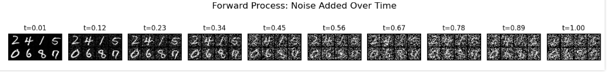
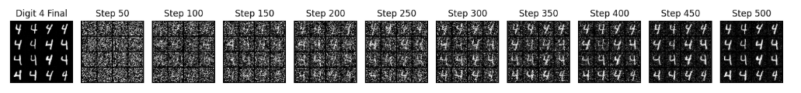

# 🧠 Conditional DDPM from Scratch (MNIST)

This project implements a Conditional Denoising Diffusion Probabilistic Model (DDPM) from scratch using PyTorch, with Transformer-based attention and class conditioning. The model is trained on MNIST to learn controllable generation conditioned on digit labels.

## 🚀 Features

- Forward & reverse diffusion processes

- Class-conditional generation

- Transformer-based UNet backbone with attention

- Euler-Maruyama sampling

- Fourier time embeddings

- Training from scratch on MNIST

## 📘 Theoretical Foundations

### 🧪 Forward Diffusion Process

**Formula**  

$$
    x_t = x_0 + \sigma(t) \cdot \epsilon, \quad \epsilon \sim \mathcal{N}(0, I)
$$

Where:

- $x_t$ is the noisy image at time $t$

- $x_0$ is the initial clean image

- $\sigma(t)$ is a time-dependent noise schedule (standard deviation)

- $\epsilon$ is a standard normal random variable (noise)

Adds noise to clean image to to simulate different diffusion timesteps.
**Code**

```python
t = torch.rand(batch_size, device=images.device) * (1 - eps) + eps
noise = torch.randn_like(images)
std = marginal_std_fn(t)
noisy_images = images + noise * std[:, None, None, None]
```

### 🔁 Euler-Maruyama Reverse Process (Sampler)

**Formula**  
Simulates the reverse diffusion step using Euler-Maruyama discretization:

$$
x_{t-\Delta t} = x_t + \frac{g(t)^2}{2} \cdot s_\theta(x_t, t, y) \cdot \Delta t + g(t) \cdot \sqrt{\Delta t} \cdot z
$$

**Where:**

- $x_t$ is the noisy image at time $t$  
- $\Delta t$ is the timestep size  
- $g(t)$ is the diffusion coefficient (noise scale)  
- $s_\theta(x_t, t, y)$ is the score function (model output)  
- $z \sim \mathcal{N}(0, I)$ is Gaussian noise  

**Code**:

```python
score = score_model(x, current_t, class_labels)
mean_x = x + (g ** 2)[:, None, None, None] * score * step_size / 2
x = mean_x + torch.sqrt(step_size) * g[:, None, None, None] * torch.randn_like(x)
```

### 📈 Marginal Standard Deviation Function

**Formula**  
This function defines a time-dependent noise schedule:

$$
\sigma(t) = \sqrt{1 - \cos^2\left( \frac{(t + 0.008)}{1.008} \cdot \frac{\pi}{2} \right)}
$$

**Where:**

- $t \in (0, 1]$ is the normalized diffusion time  
- Constants `0.008` and `1.008` ensure numerical stability  
- This schedule smoothly increases noise over time  

**Code**:

```python
def marginal_std(t, beta_min=0.1, beta_max=20.0):
    t = t.clone().detach().to(device)
    alpha_t = torch.cos((t + 0.008) / 1.008 * np.pi / 2) ** 2
    return torch.sqrt(1 - alpha_t)
```

### 🧠 Denoising Score Matching Loss

**Formula**  
The model is trained to predict the added noise using **denoising score matching**:

```math
\mathcal{L}_{DSM} = \mathbb{E}_{x_0, \epsilon, t} \left[ \left| \epsilon + \sigma(t) \cdot s_\theta(x_t, t, y) \right|^2 \right]
```

**Where:**

- $x_0$ is the clean image  
- $x_t = x_0 + \sigma(t) \cdot \epsilon$ is the noisy image  
- $\epsilon \sim \mathcal{N}(0, I)$ is the noise  
- $s_\theta(x_t, t, y)$ is the model’s predicted score  
- $\sigma(t)$ is the time-dependent standard deviation  
- The loss encourages the model to denoise $x_t$ by predicting $-\epsilon / \sigma(t)$

**Code**:

```python
score = model(noisy_images, t, labels)  # s_theta(x_t, t, y)
loss = torch.mean(torch.sum((score * std[:, None, None, None] + noise) ** 2, dim=[1, 2, 3]))
```

### ⏱ Time Embedding via Random Fourier Features

**Formula**  
To help the model understand the current diffusion time \( t \), it is embedded using sinusoidal Fourier features:

$$
\gamma(t) = \left[ \sin(2\pi w_1 t), \cos(2\pi w_1 t), \dots, \sin(2\pi w_{d/2} t), \cos(2\pi w_{d/2} t) \right]
$$

**Where:**

- $\gamma(t)$ is the time embedding vector  
- $w_i$ are fixed or learnable frequencies sampled from a Gaussian  
- $d$ is the embedding dimension (even number)  
- This is inspired by **positional encodings** in Transformers

**Code**:

```python
proj = t[:, None] * self.weight[None, :] * 2 * np.pi
return torch.cat([torch.sin(proj), torch.cos(proj)], dim=-1)
```

### 🧩 Self-Attention in Transformers

**Formula**  
Self-attention computes interactions between tokens:

$$
\text{Attention}(Q, K, V) = \text{softmax} \left( \frac{Q K^\top}{\sqrt{d_k}} \right) V
$$

**Where:**

- $Q = X W^Q$: Query matrix  
- $K = X W^K$: Key matrix  
- $V = X W^V$: Value matrix  
- $d_k$: Dimensionality of the key vectors  
- Each token attends to every other token in the sequence  
- Used in both encoder and decoder layers of Transformer blocks

**Code**:

```python
Q = self.query(tokens)  # shape: [B, T, H]
K = self.key(tokens)    # shape: [B, T, H]
V = self.value(tokens)  # shape: [B, T, H]

scores = torch.einsum("BTH,BSH->BTS", Q, K) / math.sqrt(self.embed_dim)
attn = torch.softmax(scores, dim=-1)
output = torch.einsum("BTS,BSH->BTH", attn, V)
return output
```

### 🔀  Cross-Attention

**Formula**  
Cross-attention uses a different input (context) for keys and values:

$$
\text{Attention}(Q, K, V) = \text{softmax} \left( \frac{Q K^\top}{\sqrt{d_k}} \right) V
$$

> Same formula as self-attention, but **queries** come from one source (e.g. image tokens), and **keys/values** come from another (e.g. text conditioning).

**Where:**

- $Q = X_q W^Q$: queries from main input (e.g. image or latent tokens)  
- $K = X_c W^K$, $V = X_c W^V$: keys and values from **context input** (e.g. text or class labels)  
- This allows the model to **attend to external information** like class, caption, or segmentation mask

**Code**:

```python
Q = self.query(tokens)        # queries from image or main input
K = self.key(context)         # keys from context (e.g., text)
V = self.value(context)       # values from context

scores = torch.einsum("BTH,BSH->BTS", Q, K) / math.sqrt(self.embed_dim)
attn = torch.softmax(scores, dim=-1)
output = torch.einsum("BTS,BSH->BTH", attn, V)
return output
```

### 🧮 Score Normalization (Reverse Step Output)

**Formula**  
The final output of the UNet is divided by the marginal standard deviation to normalize the predicted score:

$$
\hat{s}_\theta(x_t, t, y) = \frac{\text{UNet}(x_t, t, y)}{\sigma(t)}
$$

**Where:**

- $\hat{s}_\theta$: normalized score function used in reverse sampling  
- $\text{UNet}(x_t, t, y)$: raw output from the neural network  
- $\sigma(t)$: marginal standard deviation at time $t$

**Why Normalize?**

- Ensures that the output has the same **scale** as the noise that was added
- Makes training **numerically stable** and ensures **correct gradient scaling**
- Often used before applying the score to reverse sampling (Euler-Maruyama or DDIM)

**Code**:

```python
h = h / self.marginal_std_func(t)[:, None, None, None]
```

### 📉 Learning Rate Decay Schedule

**Formula**  
A simple exponential decay schedule for the learning rate:

$$
\text{lr}(e) = \max(0.2, \ 0.98^e)
$$

**Where:**

- $e$ is the current epoch  
- $\text{lr}(e)$: learning rate at epoch $e$  
- The learning rate decays by a factor of **0.98 per epoch**, but never goes below **0.2**

**Why Use This?**

- Slows down learning over time to help the model **converge smoothly**
- The `max()` ensures the learning rate doesn’t vanish completely

**Code**:

```python
from torch.optim.lr_scheduler import LambdaLR

scheduler = LambdaLR(optimizer, lr_lambda=lambda epoch: max(0.2, 0.98 ** epoch))
```

## 🖼️ Sampling

Generate digit samples conditioned on a label using the Euler-Maruyama sampler:

```python
final_samples, intermediate_imgs = euler_maruyama_sampler(
        score_net, 
        marginal_std_fn, 
        diffusion_coeff_fn, 
        sample_batch_size,
        num_steps=num_sampling_steps,
         device=device,
        class_labels=class_tensor, 
        save_intermediate=True
    )
```

- `final_samples`: the final generated digit images.

- `intermediate_imgs`: images generated at intermediate timesteps (useful for visualization).

## 📊 Results

### 🔄 Forward Process



### ↩️ Reverse Process (Sampling)


